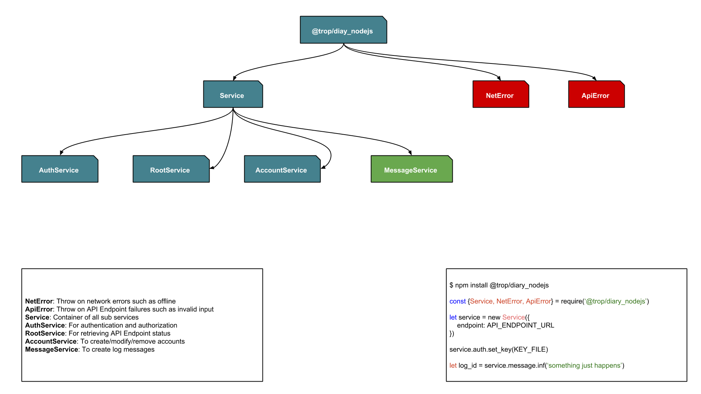

# What it is?

* This is a part of logging service [@trop/diary_api](https://trop-diary-api.netlify.com/)
* It exposes APIs of `@trop/diary_api` to Javascript APIs on Node.js.
* It is uses for clients which want to works with `@trop/diary_api`  

# How it works?

* It requires an endpoint of `@trop/diary_api`, suppose that endpoint is
  located at `API_ENDPOINT_URL`
* It also requires an key file for authentication, suppose that there are
  an key file at `KEY_FILE`
* Then just create an instance of [class Service](api_service.md) and use,
  look at this model

# What is next?

* It is just basic, there are more options for authentication, checkout
  [class AuthService](api_auth_service.md)
* What are you waiting for, checkout
  [class MessageService](api_message_service.md), it is main point
